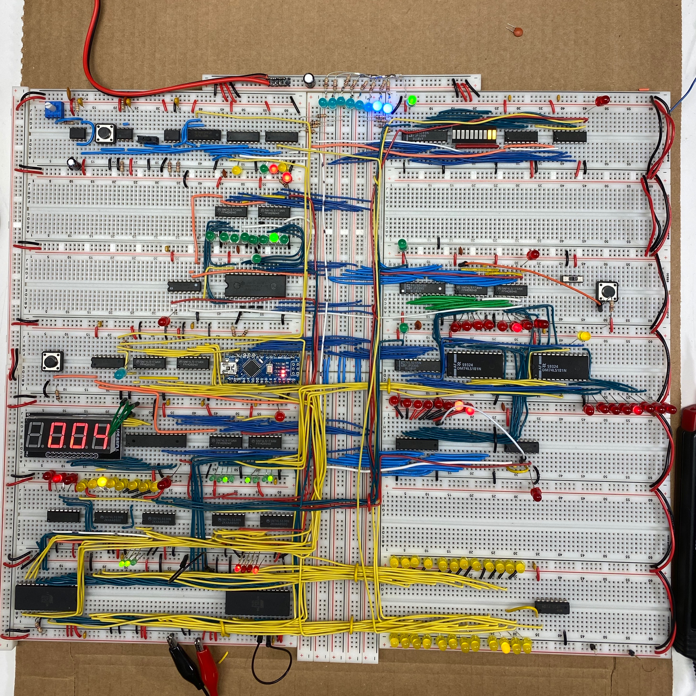

# NQSAP

The Not Quite Simple As Possible Computer

The NQSAP is a breadoard TTL computer that follows the
[Ben Eater 8-bit computer (SAP-1)](https://eater.net/8bit) design with some enhancements
and extensions.

Highlights of the design are:

* 8-bit addressing extends the size of memory and number of opcodes
* 74LS181 ALU instead of adder provides arithmetic and logic operations including add,
  subtract, AND, OR, and XOR
* Arduino-based loader/debugger to load programs and run interactive diagnostics
* 3-to-8 Decoders for register selection simplifies wiring and reduces the number of
  microcode bits needed while also protecting against inadvertent bus collisions
* 8-bit Stack Pointer for storage and subroutines

This repo contains:

* [NQSAP documentation](https://tomnisbet.github.io/nqsap/)
* Arduino-based Microcode programmer
* Arduino Nano-based System Loader / Debugger

|                 |     |              |
|:---             |:---:|          ---:|
| Clock           | bus |PC            |
|SP      /  MAR   |     |              |
|Memory           |     |A Register    |
|Reset   /  Loader|     |ALU           |
|Output  /  IR    |     |ALU B Register|
|Ring Ctr / Addr  |     |              |
|uCode ROMs       |     |Control LEDs  |
